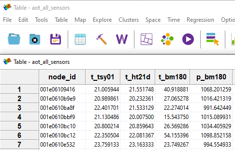
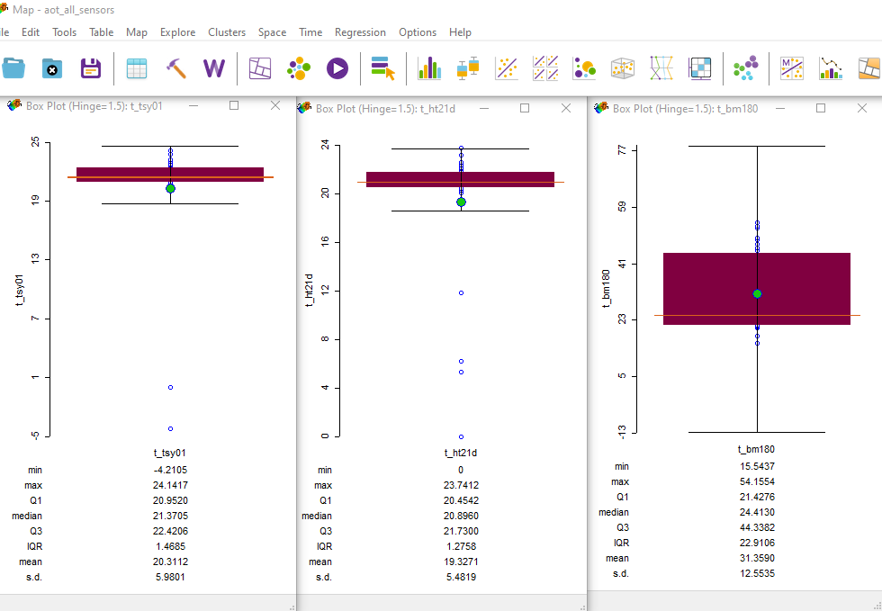
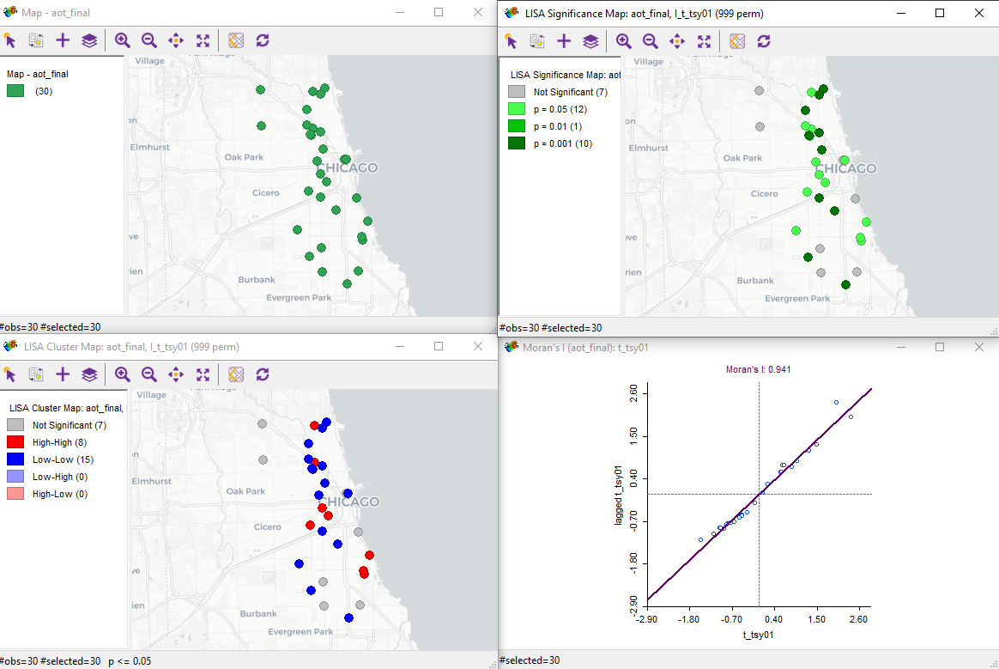
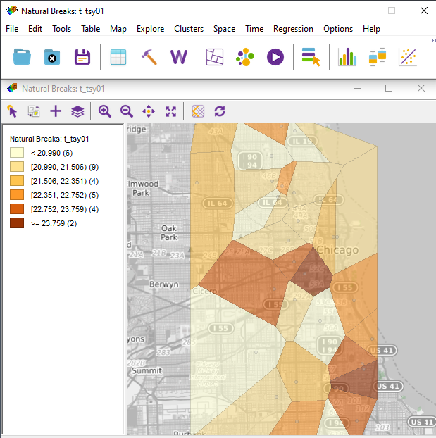

<!-- Environment Setup -->
```{r setup, include=FALSE}
knitr::opts_chunk$set(tidy.opts=list(width.cutoff=60),
                      tidy=TRUE,
                      echo = TRUE,
                      warning = FALSE,
                      message = FALSE)

# output configurations

# github
# output:
#  github_document:
#   toc: TRUE

# html
# output:
#  html_document:
#   toc: TRUE

# pdf
# output: pdf_document
# urlcolor: blue
# toc: TRUE
```

## Background

Initially the idea was to compare GeoDa to R or ArcGIS. After investigating
I found that the purpose of GeoDa is exploratory spatial data analysis.
This is supported in Johnson (2015) thesis:

> *"In this study, the spatial autocorrelation exploration tool in GeoDa was used*
> *to first determine the presence or absence of any spatial relationship in the*
> *dataset. This provided the logical background for further analysis in ArcGIS."*

Also L4: Cluster Analysis: Spatial Autocorrelation from PennState GEOG 586 states:

> *"This week's project uses not a GIS program, but a package for exploratory*
> *spatial data analysis called GeoDa. GeoDa is a good example of research software."*

It is not appropriate to compare GeoDa vs. R because they are complementary tools.


## Objective

Explore how GeoDa can be used in collaboration with R.

The exploration is guided by Kolak (2018) Array of Things (aot) Workshop, and L4 from
PennState GEOG 586.


### Scenario to Guide the Exploration

A local Chicago company is developing a temperature web service. The goal is to provide
a temperature map of Chicago every hour with temperature data at every location across the city.
The website will use this data to send users the temperature given their lat lon coordinates.

To create the temperature surface the company has a network of sensors. The aot data set
represents a network of sensors throughout Chicago that collect temperature, humidity, and pressure.

* Sensor **tsys01** collected only temp data in C [TSYS01 - High Accuracy Temperature Sensor](https://www.te.com/commerce/DocumentDelivery/DDEController?Action=showdoc&DocId=Data+Sheet%7FTSYS01%7FA%7Fpdf%7FEnglish%7FENG_DS_TSYS01_A.pdf%7FG-NICO-018)

* Sensor **htu21d** collected temp in C and humidity in RH data [HTU21D-F Temperature + Humidity Sensor](https://www.adafruit.com/product/1899)

* Sensor **bmp180** collected temp in C and pressure in hPa [BMP180 Barometric Pressure/Temperature/Altitude Sensor](https://www.adafruit.com/product/1603)

This data is point data, so making the temperature surface requires interpolation
of the point data to the temperature surface. The deliverable for the web service
is an accurate temperature surface delivered every hour.


### Steps to Create the Temperature Surface

> * **R** generate a shapefile containing all the sensor data for a one hour range.

> * **GeoDa** explore the data to determine suitable temperature data for final surface.

> * **R** generate the final shapefile containing final average temperature for a one hour range.

> * **GeoDa** explore the temperature data and determine spatial autocorrelation of temperature data.

> * **R** validate GeoDa spatial autocorrelation with a variogram in R.

> * **R** use Kriging to interpolate temperature surface raster of Chicago.

After this proof of concept the team will investigate automating the creation of
the interpolated temperature surface every hour.

* Integration of sensor data delivery to R service.

* Create R service workers: shapefile generation, data scrubber, variogram metadata,
 and temperature surface generator.
 
* Create web service to deliver temperature surface to clients.


### Data

The data used is from the aot workshop and can be found: https://geodacenter.github.io/aot-workshop/

The actual data used is from GIS 335 Lab 5 R interp, included with week 11 materials.


## Methods


### Generate Shapefile for All Sensors

```{r node_data}
# Load Packages
library(tidyverse)
library(lubridate)
library(sp)
library(rgdal)

# Clear Workspace
rm(list = ls())

# Read Data
sensor_data <- read.csv("Data/data.csv.gz")
nodes <- read.csv("Data/nodes.csv")

# Fix timestamp so GeoDa doesn't crash on import
sensor_data$timestamp <- ymd_hms(sensor_data$timestamp)
nodes$start_timestamp <- ymd_hms(nodes$start_timestamp)
nodes$end_timestamp <- ymd_hms(nodes$end_timestamp)

# Filter Sensors by Sensor for hour
fhour <- 12 # filter hour

# tsys01 temperature C
temp_tsys01 <- sensor_data %>%
  filter(sensor == "tsys01") %>%
  filter(parameter == "temperature") %>%
  filter(hour(timestamp) >= fhour) %>%
  filter(fhour >= hour(timestamp)) %>%
  group_by(node_id) %>%
  summarize(t_tsys01 = mean(value_hrf))

# htu21d temperature C
temp_htu21d <- sensor_data %>%
  filter(sensor == "htu21d") %>%
  filter(parameter == "temperature") %>%
  filter(hour(timestamp) >= fhour) %>%
  filter(fhour >= hour(timestamp)) %>%
  group_by(node_id) %>%
  summarize(t_htu21d = mean(value_hrf))

# htu21d humidity RH
humid_htu21d <- sensor_data %>%
  filter(sensor == "htu21d") %>%
  filter(parameter == "humidity") %>%
  filter(hour(timestamp) >= fhour) %>%
  filter(fhour >= hour(timestamp)) %>%
  group_by(node_id) %>%
  summarize(h_htu21d = mean(value_hrf))

# bmp180 temperature C
temp_bmp180 <- sensor_data %>%
  filter(sensor == "bmp180") %>%
  filter(parameter == "temperature") %>%
  filter(hour(timestamp) >= fhour) %>%
  filter(fhour >= hour(timestamp)) %>%
  group_by(node_id) %>%
  summarize(t_bmp180 = mean(value_hrf))

# bmp180 pressure hPa
press_bmp180 <- sensor_data %>%
  filter(sensor == "bmp180") %>%
  filter(parameter == "pressure") %>%
  filter(hour(timestamp) >= fhour) %>%
  filter(fhour >= hour(timestamp)) %>%
  group_by(node_id) %>%
  summarize(p_bmp180 = mean(value_hrf))

# Join Sensor Data by Nodes
j1 <- merge(temp_tsys01, temp_htu21d, by = c("node_id"), all = TRUE)
j2 <- merge(j1, temp_bmp180, by = c("node_id"), all = TRUE)
j3 <- merge(j2, press_bmp180, by = c("node_id"), all = TRUE)
j4 <- merge(j3, humid_htu21d, by = c("node_id"), all = TRUE)
node_data <- merge(j4, nodes, by = c("node_id"))

# Convert node data to spatial object
coordinates(node_data) <- node_data[,c("lon", "lat")]

# set data to the same projection
# proj4string(node.temps) <- CRS("+init=epsg:4326")
# Error in CRS("+init=epsg:4326") : NA
# https://gis.stackexchange.com/questions/387072/r-spcrs-returns-na
proj4string(node_data) <- CRS(sf::st_crs(4326)[[2]])

# writeOGR(node_data, ".", "aot_all_sensors", driver = "ESRI Shapefile")
```


### Explore Sensor Data in GeoDa

**Note:** the shapefile data is temperature, humidity, and pressure data from
Chicago 2018-08-25 between 12:00 and 13:00. This means that because it is August
in Chicago the temperature should be ~ 20 C and probably not below 0 C or above 40 C.

Each node has a tsys01 (temperature only), htu21d (temperature and humidity),
and bmp180 (temperature and pressure) sensor. We are only interested in temperature, 
yet investigating the data for each sensor could provide some insight into what data
to use for the final temperature data set.

The tsys01 sensor is a **High Accuracy Temperature Sensor**, so its data considered
as first priority for the node's final reading. Sometimes the tsys01 provides readings that
do not make sense, and for other nodes there is no data for the tsys01 sensor.
 We need to use GeoDa to explore the variables so the best decision can be made about
the final temperature data.


#### Table Investigation

GeoDa has a table view to investigate the shapefile attributes.




```{r shapefile_table, echo = FALSE}
library(tidyverse)
library(knitr)

# Clear Workspace
rm(list = ls())

shapefile_table <- data.frame(node_id = c("001e06109416", "001e0610fb4c", "001e0611536c",
                                          "001e0610e809"),
                 t_tsys01 = c(21.01, 20.91, "NA", -4.21),
                 t_htu21d = c(21.55, "NA", 22.33, 20.44),
                 t_bmp180 = c(40.92, 20.93, 43.51, 21.09))

kable(shapefile_table, align = "lccc", caption = "Sensor Temperature Variation")
```


**Notice** that for this sample some nodes have large differences in temperature values between
sensors, and some nodes have no data for a particular sensor. To fix this we could use the
temperature data from tsys01 first then if there is a problem, i.e. an outlier or NA
then we could use data from the other sensors from the same node. Also some values
are below 0 C and above 40 C.


#### GeoDa Box Plots



**Notice** that each sensor has outliers, and some sensors have large variation
between temperature readings.


#### GeoDa Scatter Plots

To answer the question **Why does tsys01 sometimes produce incorrect data?** we
could look for correlation between various sensor data using scatter plots.


**Compare temp_tsys01 to Each Sensor**

```{r sp_table, echo=FALSE}
library(tidyverse)
library(knitr)

# Clear Workspace
rm(list = ls())

img1_path <- "Data/sp1.PNG"
img2_path <- "Data/sp2.PNG"
img3_path <- "Data/sp3.PNG"
img4_path <- "Data/sp4.PNG"

temp_htu21d <- data.frame(
  t_htu21d = c(paste0("{#id .class height=400px}"), "temp_tsys01 vs. temp_htu21d")
)
humid_htu21d <- data.frame(
  h_htu21d = c(paste0("{#id .class height=400px}"), "temp_tsys01 vs. humid_htu21d")
)
temp_bmp180 <- data.frame(
  t_bmp180 = c(paste0("{#id .class height=400px}"), "temp_tsys01 vs. temp_bmp180")
)
press_bmp180 <- data.frame(
  p_bmp180 = c(paste0("{#id .class height=400px}"), "temp_tsys01 vs. press_bmp180")
)

knitr::kable(temp_htu21d, format = 'pandoc')

knitr::kable(humid_htu21d, format = 'pandoc')

knitr::kable(temp_bmp180, format = 'pandoc')

knitr::kable(press_bmp180, format = 'pandoc')
```


### Generate Final Shapefile

There appears to be no correlation between the other temperature sensors on the same
node for extreme values. Also there appears to be no correlation between pressure or
humidity.


**Check Nodes at Various Hours**

```{r temp_table, echo = FALSE}
library(tidyverse)
library(knitr)

# Clear Workspace
rm(list = ls())

temp_table <- data.frame(node_id = c("001e0610e809", "Mean All Nodes", "001e0611536c"),
                 Hour7 = c(-7.6, 19.3, "NA"),
                 Hour12 = c(-4.2, 20.3, "NA"),
                 Hour22 = c(18.6, 30.8, "NA"))

kable(temp_table, align = "lccc", caption = "Outlier Nodes Various Hours")
```


It appears that node **001e0610e809** is not working correctly, and node **001e0611536c**
has no tsys01 sensor.

In the future we could replace faulty nodes, add tsys01 sensors, or create an algorithm
to use temperature data from the other sensors.

For the final shapefile we will remove the outlier nodes and use only the tsys01 sensor
data for the temperature surface.

```{r final_node_data}
# Load Packages
library(tidyverse)
library(lubridate)
library(sp)
library(rgdal)

# Clear Workspace
rm(list = ls())

# Read Data
sensor_data <- read.csv("Data/data.csv.gz")
nodes <- read.csv("Data/nodes.csv")

# Fix timestamp so GeoDa doesn't crash on import
sensor_data$timestamp <- ymd_hms(sensor_data$timestamp)
nodes$start_timestamp <- ymd_hms(nodes$start_timestamp)
nodes$end_timestamp <- ymd_hms(nodes$end_timestamp)

# Filter Sensors by Sensor for hour
fhour <- 12 # filter hour

# tsys01 temperature C
temp_tsys01 <- sensor_data %>%
  filter(sensor == "tsys01") %>%
  filter(parameter == "temperature") %>%
  filter(hour(timestamp) >= fhour) %>%
  filter(fhour >= hour(timestamp)) %>%
  group_by(node_id) %>%
  summarize(t_tsys01 = mean(value_hrf))

# Remove outlier nodes 001e0610e809, and 001e0611536c
temp_tsys01 <- subset(temp_tsys01, node_id != "001e0610e809")
temp_tsys01 <- subset(temp_tsys01, node_id != "001e0611536c")

# Join Sensor Data by Nodes
node_data <- merge(temp_tsys01, nodes, by = c("node_id"))

# Convert node data to spatial object
coordinates(node_data) <- node_data[,c("lon", "lat")]

# set data to the same projection
# proj4string(node.temps) <- CRS("+init=epsg:4326")
# Error in CRS("+init=epsg:4326") : NA
# https://gis.stackexchange.com/questions/387072/r-spcrs-returns-na
proj4string(node_data) <- CRS(sf::st_crs(4326)[[2]])

# writeOGR(node_data, ".", "aot_final", driver = "ESRI Shapefile")
```


### Explore Final Temperature Data GeoDa


#### Investigate Outliers and Patterns

[GeoDa Cheat Sheet](http://geodacenter.github.io/cheatsheet.html)

```{r outlier_table, echo=FALSE}
library(tidyverse)
library(knitr)

# Clear Workspace
rm(list = ls())

img1_path <- "Data/o1.PNG"
img2_path <- "Data/o2.PNG"
img3_path <- "Data/p1.PNG"
img4_path <- "Data/p2.PNG"

histo <- data.frame(
  Histogram = c(paste0("{#id .class height=400px}"), "Histogram showing distribution.")
)
bm <- data.frame(
  Box_Map = c(paste0("{#id .class height=400px}"), "Spatial histogram.")
)
bc <- data.frame(
  Bubble_Chart = c(paste0("{#id .class height=400px}"), "Visualize temperature groups.")
)
s_3D <- data.frame(
  Scatter_3D = c(paste0("{#id .class height=400px}"), "Visualize temperature groups in 3D, x: lon, y: lat, z: temp")
)

knitr::kable(histo, format = 'pandoc')

knitr::kable(bm, format = 'pandoc')

knitr::kable(bc, format = 'pandoc')

knitr::kable(s_3D, format = 'pandoc')
```

#### Investigate Spatial Autocorrelation


[L4: Spatial Autocorrelation](https://www.e-education.psu.edu/geog586/node/524)


[Weights File Creation](https://www.e-education.psu.edu/geog586/node/671)


**Global Moran's I**


**From L4 Spatial Autocorrelation:**

* Cases in the upper-right quadrant indicate nodes temps, and local average node temps
are higher than overall average node temps.

* Cases in the lower-left quadrand indicate node temps, and local average node temps
are lower than overall average node temps.

*Indicates positive spatial autocorrelation for the tsys01 data.*


**Local Indicators of Spatial Association - LISA**




**Spatial Correlogram**


[Spatial Correlogram - GeoDa Workbook](https://geodacenter.github.io/workbook/5a_global_auto/lab5a.html#spatial-correlogram)

> *A measure of global spatial autocorrelation... a local regression is fit to the*
> *covariances or correlations computed for all pairs of observations as a function*
> *of the distance between them.*


*Depicts how the spatial autocorrelation changes with distance.*


#### Thiessen Polygons

*Early Estimate of Temperature Surface*




## Results

### Interpolate a Temperature Surface

```{r krig, echo=FALSE}
library(sp) #spatial data wrangling & analysis
library(rgdal) #spatial data wrangling
library(rgeos) #spatial data wrangling & analytics
library(tidyverse) # data wrangling
library(tmap) #modern data visualizations
library(leaflet) #modern data visualizations
library(lubridate) #data wrangling
library(raster) #spatial raster data wrangling
library(gstat) #kriging and geostatistics

# Clear Workspace
rm(list = ls())

# Read Data
sensor_data <- read.csv("Data/data.csv.gz")
nodes <- read.csv("Data/nodes.csv")
chiCA <- readOGR("Data","ChiComArea", verbose = FALSE)

# Fix timestamp so GeoDa doesn't crash on import
sensor_data$timestamp <- ymd_hms(sensor_data$timestamp)
nodes$start_timestamp <- ymd_hms(nodes$start_timestamp)
nodes$end_timestamp <- ymd_hms(nodes$end_timestamp)

# Filter Sensors by Sensor for hour
fhour <- 12 # filter hour

# tsys01 temperature C
temp_tsys01 <- sensor_data %>%
  filter(sensor == "tsys01") %>%
  filter(parameter == "temperature") %>%
  filter(hour(timestamp) >= fhour) %>%
  filter(fhour >= hour(timestamp)) %>%
  group_by(node_id) %>%
  summarize(t_tsys01 = mean(value_hrf))

# Remove outlier nodes 001e0610e809, and 001e0611536c
temp_tsys01 <- subset(temp_tsys01, node_id != "001e0610e809")
temp_tsys01 <- subset(temp_tsys01, node_id != "001e0611536c")

# Join Sensor Data by Nodes
node_data <- merge(temp_tsys01, nodes, by = c("node_id"))

# Convert node data to spatial object
coordinates(node_data) <- node_data[,c("lon", "lat")]

# generate a grid from Chicago area
pt2grid <- function(ptframe,n) {
  bb <- bbox(ptframe)  
  ptcrs <- proj4string(ptframe)  
  xrange <- abs(bb[1,1] - bb[1,2])  
  yrange <- abs(bb[2,1] - bb[2,2])  
  cs <- c(xrange/n,yrange/n)  
  cc <- bb[,1] + (cs/2)  
  dc <- c(n,n)  
  x1 <- GridTopology(cellcentre.offset=cc,cellsize=cs,cells.dim=dc)  
  x2 <- SpatialGrid(grid=x1,proj4string=CRS(ptcrs))
  return(x2)
}

# plot 100 x 100 cell grid
chi.grid <- pt2grid((chiCA),100)

# set data to the same projection
# proj4string(node.temps) <- CRS("+init=epsg:4326")
# Error in CRS("+init=epsg:4326") : NA
# https://gis.stackexchange.com/questions/387072/r-spcrs-returns-na
proj4string(node_data) <- CRS(sf::st_crs(4326)[[2]])
proj4string(chiCA) <- CRS(sf::st_crs(4326)[[2]])
proj4string(chi.grid) <- CRS(sf::st_crs(4326)[[2]])

# variogram
tmp.vgm <- variogram(node_data$t_tsys01 ~ 1, node_data)

# plot exponential model
tmp.fit.exp<- fit.variogram(tmp.vgm, model=vgm("Exp"))

# prepare exponential
temp.kriged.exp <- krige(node_data$t_tsys01 ~ 1, node_data, chi.grid, model = tmp.fit.exp, debug.level = 0)
chi.temp.kriged.exp <- temp.kriged.exp[chiCA,]

# plot exponential krig
m.exp <- tm_shape(chi.temp.kriged.exp) +
  tm_raster("var1.pred", style = "jenks", title = "Temperature (C)", palette = "BuPu") + tm_shape(node_data) + tm_dots(size=0.01) +
  tm_layout(main.title = "Exp Krig Avg Temp 2018-08-25 between 12:00 and 13:00", main.title.size = 1.1) +
  tm_legend(position = c("left", "bottom"))

plot(tmp.vgm, tmp.fit.exp)

tmap_arrange(m.exp)

```


## Conclusion

## References

* Johnson, Crystal, "Using Kriging, Cokriging, and GIS to Visualize Fe and Mn in Groundwater" (2015). Electronic Theses and Dissertations. Paper 2498. https://dc.etsu.edu/etd/2498 , https://dc.etsu.edu/cgi/viewcontent.cgi?article=3881&context=etd

* MAPPING AOT DATA WITH SPATIAL STATISTICS, ARRAY OF THINGS WORKSHOP 2018
FACILITATED BY M. KOLAK https://geodacenter.github.io/aot-workshop/

* PennState GEOG 586 - Geographic Information Analysis L4: Cluster Analysis: Spatial Autocorrelation https://www.e-education.psu.edu/geog586/node/524
