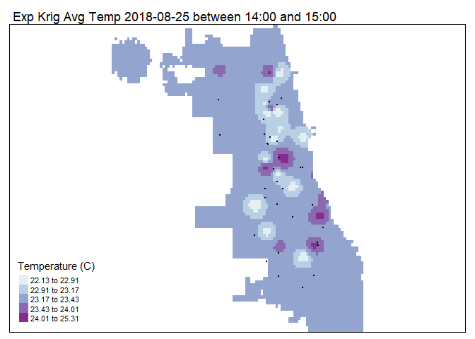

GIS 335 Final Presentation - GeoDa in Collaboration with R
================
James Jahraus
2021-12-13

-   [Presentation Objective](#presentation-objective)
-   [Scenario to Guide the
    Exploration](#scenario-to-guide-the-exploration)
-   [Generate Shapefile for All
    Sensors](#generate-shapefile-for-all-sensors)
-   [Explore the Data in GeoDa](#explore-the-data-in-geoda)
-   [Generate Shapefile for tsys01](#generate-shapefile-for-tsys01)
-   [Explore Final Temperature Data
    GeoDa](#explore-final-temperature-data-geoda)
    -   [Investigate Outliers and
        Patterns](#investigate-outliers-and-patterns)
    -   [Investigate Spatial
        Autocorrelation](#investigate-spatial-autocorrelation)
-   [Interpolate a Temperature
    Surface](#interpolate-a-temperature-surface)

<!-- Environment Setup -->

## Presentation Objective

Share with the class the experience of using GeoDa in collaboration with
R.

**Key take aways:**

-   Demonstrate how GeoDa works in collaboration with R.

-   Gain curiosity about using GeoDa for exploratory spatial data
    analysis.

The exploration is guided by Kolak (2018) Array of Things (aot)
Workshop, and L4 from PennState GEOG 586.

## Scenario to Guide the Exploration

A local Chicago company is developing a temperature web service. The
goal is to provide a temperature map of Chicago every hour with
temperature data at every location across the city. The website will use
this data to send users the temperature given their lat lon coordinates.

To create the temperature surface the company has a network of sensors.
The aot data set represents a network of sensors throughout Chicago that
collect temperature, humidity, and pressure.

-   Sensor **tsys01** collected only temp data in C [TSYS01 - High
    Accuracy Temperature
    Sensor](https://www.te.com/commerce/DocumentDelivery/DDEController?Action=showdoc&DocId=Data+Sheet%7FTSYS01%7FA%7Fpdf%7FEnglish%7FENG_DS_TSYS01_A.pdf%7FG-NICO-018)

-   Sensor **htu21d** collected temp in C and humidity in RH data
    [HTU21D-F Temperature + Humidity
    Sensor](https://www.adafruit.com/product/1899)

-   Sensor **bmp180** collected temp in C and pressure in hPa [BMP180
    Barometric Pressure/Temperature/Altitude
    Sensor](https://www.adafruit.com/product/1603)

This data is point data, so making the temperature surface requires
interpolation of the point data to the temperature surface. The
deliverable for the web service is an accurate temperature surface
delivered every hour.

## Generate Shapefile for All Sensors

**Choose the Hour for Node Data**

``` r
# Load Packages
library(tidyverse)
library(lubridate)
library(sp)
library(rgdal)

# Clear Workspace
rm(list = ls())

# Read Data
sensor_data <- read.csv("Data/data.csv.gz")
nodes <- read.csv("Data/nodes.csv")

# Fix timestamp so GeoDa doesn't crash on import
sensor_data$timestamp <- ymd_hms(sensor_data$timestamp)
nodes$start_timestamp <- ymd_hms(nodes$start_timestamp)
nodes$end_timestamp <- ymd_hms(nodes$end_timestamp)

# Filter Sensors by Sensor for hour
fhour <- 14  # filter hour

# tsys01 temperature C
temp_tsys01 <- sensor_data %>%
    filter(sensor == "tsys01") %>%
    filter(parameter == "temperature") %>%
    filter(hour(timestamp) >= fhour) %>%
    filter(fhour >= hour(timestamp)) %>%
    group_by(node_id) %>%
    summarize(t_tsys01 = mean(value_hrf))

# htu21d temperature C
temp_htu21d <- sensor_data %>%
    filter(sensor == "htu21d") %>%
    filter(parameter == "temperature") %>%
    filter(hour(timestamp) >= fhour) %>%
    filter(fhour >= hour(timestamp)) %>%
    group_by(node_id) %>%
    summarize(t_htu21d = mean(value_hrf))

# htu21d humidity RH
humid_htu21d <- sensor_data %>%
    filter(sensor == "htu21d") %>%
    filter(parameter == "humidity") %>%
    filter(hour(timestamp) >= fhour) %>%
    filter(fhour >= hour(timestamp)) %>%
    group_by(node_id) %>%
    summarize(h_htu21d = mean(value_hrf))

# bmp180 temperature C
temp_bmp180 <- sensor_data %>%
    filter(sensor == "bmp180") %>%
    filter(parameter == "temperature") %>%
    filter(hour(timestamp) >= fhour) %>%
    filter(fhour >= hour(timestamp)) %>%
    group_by(node_id) %>%
    summarize(t_bmp180 = mean(value_hrf))

# bmp180 pressure hPa
press_bmp180 <- sensor_data %>%
    filter(sensor == "bmp180") %>%
    filter(parameter == "pressure") %>%
    filter(hour(timestamp) >= fhour) %>%
    filter(fhour >= hour(timestamp)) %>%
    group_by(node_id) %>%
    summarize(p_bmp180 = mean(value_hrf))

# Join Sensor Data by Nodes
j1 <- merge(temp_tsys01, temp_htu21d, by = c("node_id"), all = TRUE)
j2 <- merge(j1, temp_bmp180, by = c("node_id"), all = TRUE)
j3 <- merge(j2, press_bmp180, by = c("node_id"), all = TRUE)
j4 <- merge(j3, humid_htu21d, by = c("node_id"), all = TRUE)
node_data <- merge(j4, nodes, by = c("node_id"))

# Convert node data to spatial object
coordinates(node_data) <- node_data[, c("lon", "lat")]

# set data to the same projection proj4string(node.temps)
# <- CRS('+init=epsg:4326') Error in CRS('+init=epsg:4326')
# : NA
# https://gis.stackexchange.com/questions/387072/r-spcrs-returns-na
proj4string(node_data) <- CRS(sf::st_crs(4326)[[2]])

writeOGR(node_data, ".", "pres_all_sensors", driver = "ESRI Shapefile")
```

## Explore the Data in GeoDa

-   Overview of the [GeoDa Cheat
    Sheet](http://geodacenter.github.io/cheatsheet.html)

-   Generate box plots for each sensor

> Goal explore the distribution of each sensor.

-   Generate scatter plots for each sensor

> Goal explore correlations between sensor data.

> Maybe the sensors are integrated and high pressure causes faulty
> reading on **tsys01**

It appears that node **001e0610e809** is not working correctly, and node
**001e0611536c** has no tsys01 sensor.

## Generate Shapefile for tsys01

**Choose the Hour for Node Data**

``` r
# Load Packages
library(tidyverse)
library(lubridate)
library(sp)
library(rgdal)

# Clear Workspace
rm(list = ls())

# Read Data
sensor_data <- read.csv("Data/data.csv.gz")
nodes <- read.csv("Data/nodes.csv")

# Fix timestamp so GeoDa doesn't crash on import
sensor_data$timestamp <- ymd_hms(sensor_data$timestamp)
nodes$start_timestamp <- ymd_hms(nodes$start_timestamp)
nodes$end_timestamp <- ymd_hms(nodes$end_timestamp)

# Filter Sensors by Sensor for hour
fhour <- 14  # filter hour

# tsys01 temperature C
temp_tsys01 <- sensor_data %>%
    filter(sensor == "tsys01") %>%
    filter(parameter == "temperature") %>%
    filter(hour(timestamp) >= fhour) %>%
    filter(fhour >= hour(timestamp)) %>%
    group_by(node_id) %>%
    summarize(t_tsys01 = mean(value_hrf))

# Remove outlier nodes 001e0610e809, and 001e0611536c
temp_tsys01 <- subset(temp_tsys01, node_id != "001e0610e809")
temp_tsys01 <- subset(temp_tsys01, node_id != "001e0611536c")

# Join Sensor Data by Nodes
node_data <- merge(temp_tsys01, nodes, by = c("node_id"))

# Convert node data to spatial object
coordinates(node_data) <- node_data[, c("lon", "lat")]

# set data to the same projection proj4string(node.temps)
# <- CRS('+init=epsg:4326') Error in CRS('+init=epsg:4326')
# : NA
# https://gis.stackexchange.com/questions/387072/r-spcrs-returns-na
proj4string(node_data) <- CRS(sf::st_crs(4326)[[2]])

writeOGR(node_data, ".", "pres_tsys01", driver = "ESRI Shapefile")
```

## Explore Final Temperature Data GeoDa

### Investigate Outliers and Patterns

-   Generate box plot for tsys01

> Goal explore the distribution of tsys01.

-   Generate a bubble map for tsys01

> Goal explore x y temp pattern

### Investigate Spatial Autocorrelation

-   Space - Univariate Moran’s I

> Goal determine spatial autocorrelation of temp nodes

**Generate Weights file GeoDa Tools \> Weights Manager**

[L4: Spatial
Autocorrelation](https://www.e-education.psu.edu/geog586/node/524)

*Weights file we need a representation of the contiguity structure of
the map,* *that is, which map units are neighbors to each other.*

*Cases in the upper-right quadrant indicate nodes temps, and local
average node temps* *are higher than overall average node temps.*

*Cases in the lower-left quadrand indicate node temps, and local average
node temps* *are lower than overall average node temps.*

**We expect temperature readings for sensors close to each other to be
similar, and** **temperature readings for sensors far from each other to
be different.**

Because there is spatial autocorrelation with the tsys01 data we can use
Kriging to interpolate the temperature surface.

## Interpolate a Temperature Surface

**Choose the Hour for Node Data**

<!-- -->
